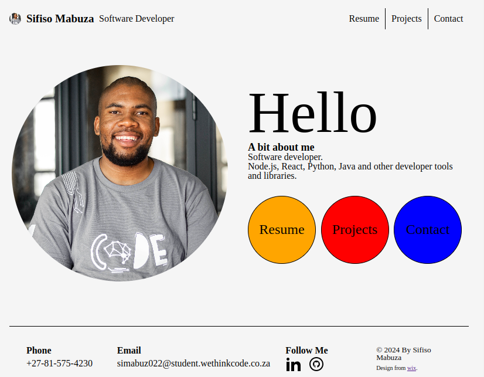

# PERSONAL WEBSITE

## Description
I have created a personal portfolio webpage to exhibit  my accomplished projects, each demonstrating the skills I have acquired during my learning journey. The portfolio was constructed using HTML, CSS, Javascript, and Webpack for bundling. Without any external frameworks or libraries.


## Docs
  - [Project Status](#project-status)
  - [Usage](#usage)
  - [For Development](#for-development)

## Project Status
  - In progress. 

[](https://skillicons.dev)

## For Development
- To run any of the commands below you will need to have the lastest versions on ***Node.js*** and ***npm*** installed on your system.
- run npm install to download all the project dependencies.
```bash
npm install
```
- run webpack to open a server locally. server restarts after changes are made to the project.
```bash
npx webpack --watch
```

## Issues
- Image sizes are currently large (> 900kb), even after optimization.